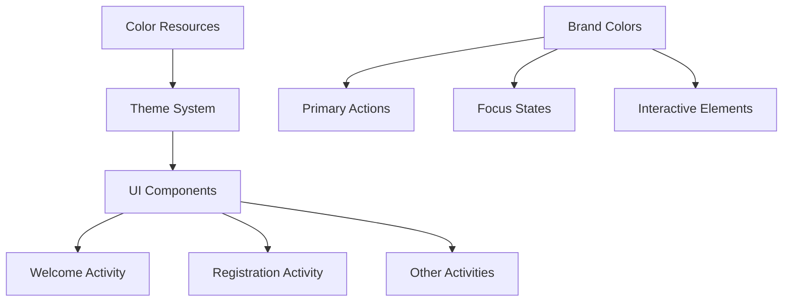
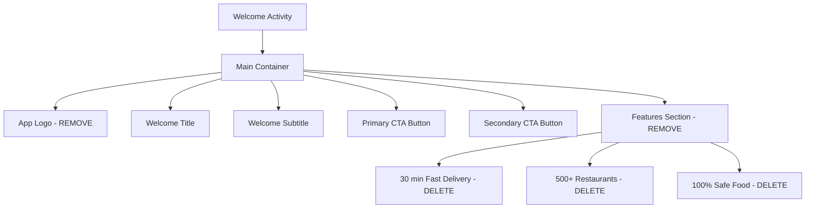
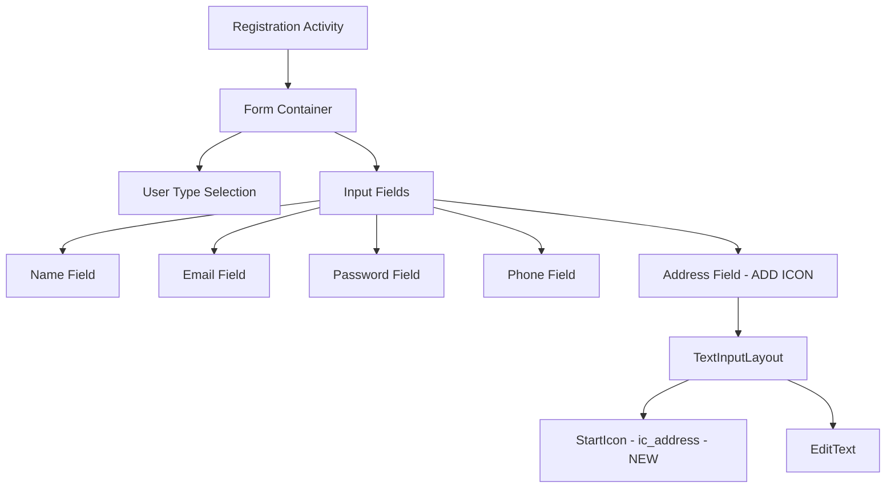

# UI Brand Color Update Design

## Overview

This design outlines the necessary changes to transition the MYFOODAPP brand color from the current red theme to a yellow theme, along with specific UI modifications to the Welcome Page and Cook Registration flow. The updates align with the existing Professional UI Design Guide which specifies yellow (#FFD60A) as the primary brand color.

## Architecture

The changes involve three main architectural components:

### 1. Color System Architecture


### 2. Welcome Page Component Architecture


### 3. Registration Form Architecture


## Component Design Specifications

### 1. Brand Color System Update

#### Primary Color Changes
| Current Color | New Color | Component Usage |
|---------------|-----------|----------------|
| `primary_red` #E23744 | `primary_yellow` #FFD60A | Primary buttons, focus states, brand elements |
| `primary_red_dark` #CB1B28 | `primary_yellow_dark` #F4A100 | Pressed states, darker accents |
| `primary_red_light` #FF6B75 | `primary_yellow_light` #FFF3B8 | Light accents, backgrounds |

#### Color Resource Mapping
```
Current Resources → New Resources
├── primary_red → primary_yellow
├── primary_red_dark → primary_yellow_dark  
├── primary_red_light → primary_yellow_light
├── button_primary → Updated to yellow
├── border_focus → Updated to yellow
└── overlay_brand → Updated to yellow overlay
```

### 2. Welcome Page Component Removal

#### Components to Remove
| Component ID | Description | Action |
|--------------|-------------|--------|
| `ivAppLogo` | Android head icon ImageView | Complete removal |
| Features LinearLayout | Container with 3 feature columns | Complete removal |
| └── Fast Delivery | "30 min" text display | Remove with parent |
| └── Restaurants | "500+" text display | Remove with parent |
| └── Safe Food | "100%" text display | Remove with parent |

#### Layout Structure After Changes
```
WelcomeActivity Layout:
├── Main ConstraintLayout
    ├── Welcome Title (tvWelcomeTitle)
    ├── Welcome Subtitle (tvWelcomeSubtitle) 
    ├── Primary CTA Button (btnBuyFood)
    └── Secondary CTA Button (btnSellFood)
```

### 3. Address Field Icon Addition

#### New Icon Resource
- **Icon Name**: `ic_address.xml`
- **Design**: Material Design location/address icon
- **Size**: 24dp standard icon size
- **Color**: `@color/text_secondary` (consistent with other field icons)

#### Implementation Structure
```xml
<TextInputLayout android:id="@+id/layoutAddress">
    <-- ADD: app:startIconDrawable="@drawable/ic_address" -->
    <-- ADD: app:startIconTint="@color/text_secondary" -->
    <TextInputEditText android:id="@+id/etAddress"/>
</TextInputLayout>
```

## UI Component Updates

### 1. Button Styling Updates
| Button Type | Background Color | Text Color | Border Color |
|-------------|------------------|------------|--------------|
| Primary | `primary_yellow` | `text_primary` (black) | None |
| Secondary | Transparent | `primary_yellow` | `primary_yellow` |
| Pressed Primary | `primary_yellow_dark` | `text_primary` | None |

### 2. Interactive Element Colors
| Element | Property | New Color |
|---------|----------|-----------|
| Radio Buttons | `buttonTint` | `primary_yellow` |
| Text Input Focus | `boxStrokeColor` | `primary_yellow` |
| Links/Clickable Text | `textColor` | `primary_yellow` |
| Status Bar | `statusBarColor` | `primary_yellow` |

### 3. Visual Hierarchy Adjustments

#### Welcome Page Spacing
With removed components, adjust spacing:
- Increase button margins from 40dp to 60dp (top margin for btnBuyFood)
- Center content vertically within available space
- Maintain 16dp spacing between primary and secondary buttons

#### Icon Consistency
All input field icons follow consistent pattern:
- Name field: `ic_person` ✓ (existing)
- Email field: `ic_email` ✓ (existing)  
- Password field: `ic_password` ✓ (existing)
- Phone field: `ic_phone` ✓ (existing)
- Address field: `ic_address` ⭐ (new)

## Implementation Requirements

### 1. Resource Files to Modify
```
/app/src/main/res/
├── values/
│   ├── colors.xml (Update brand colors)
│   └── themes.xml (Update theme references)
├── values-night/
│   ├── colors.xml (Update dark theme colors)  
│   └── themes.xml (Update dark theme references)
├── drawable/
│   ├── ic_address.xml (NEW - Create address icon)
│   ├── button_primary.xml (Update background color)
│   └── button_outline.xml (Update border color)
└── layout/
    ├── activity_welcome.xml (Remove components)
    └── activity_register.xml (Add address icon)
```

### 2. Color Values Update
```xml
<!-- Replace existing primary_red values -->
<color name="primary_yellow">#FFD60A</color>
<color name="primary_yellow_dark">#F4A100</color>
<color name="primary_yellow_light">#FFF3B8</color>

<!-- Update references -->
<color name="button_primary">@color/primary_yellow</color>
<color name="border_focus">@color/primary_yellow</color>
<color name="overlay_brand">#1AFFD60A</color>
```

### 3. Icon Design Specification
The new address icon should:
- Use Material Design location pin style
- 24dp viewbox with 2dp padding
- Single color vector drawable
- Consistent line weight with existing icons
- Support tinting for theme compatibility

## Testing Strategy

### Visual Testing Checklist
- [ ] All buttons display yellow background/border
- [ ] Focus states show yellow highlight
- [ ] Radio buttons use yellow selection color
- [ ] Welcome page removes logo and features cleanly
- [ ] Address field displays location icon consistently
- [ ] Dark/light themes both support yellow branding
- [ ] Color contrast meets accessibility standards

### Functional Testing
- [ ] Welcome page navigation still works without removed elements
- [ ] Cook registration shows address field with icon when cook is selected
- [ ] Address field validation continues to work
- [ ] Button interactions provide proper visual feedback
- [ ] Theme switching preserves yellow brand identity

### Cross-Device Testing
- [ ] Color rendering consistent across different screen types
- [ ] Icon sizing appropriate for various density screens
- [ ] Layout adjustments work on different screen sizes
- [ ] Touch targets remain accessible (48dp minimum)

## UI Consistency Guidelines

### Color Usage Rules
1. **Primary Yellow**: Use for main actions, focus states, and primary brand elements only
2. **Yellow Dark**: Reserved for pressed/active states of yellow elements  
3. **Yellow Light**: Use sparingly for subtle accents and backgrounds
4. **Text Contrast**: Ensure yellow backgrounds use dark text for readability

### Icon Guidelines
1. **Consistency**: All input field icons follow same visual weight and style
2. **Sizing**: 24dp standard size with consistent padding
3. **Coloring**: Use `text_secondary` color for neutral state, `primary_yellow` for focus
4. **Accessibility**: Icons support content descriptions and scaling

### Layout Principles
1. **Clean Design**: Removal of logo and features creates cleaner, more focused layout
2. **Progressive Disclosure**: Address field appears contextually for cook registration
3. **Visual Balance**: Maintain proper spacing and alignment without removed elements
4. **Consistency**: Apply yellow branding uniformly across all UI components